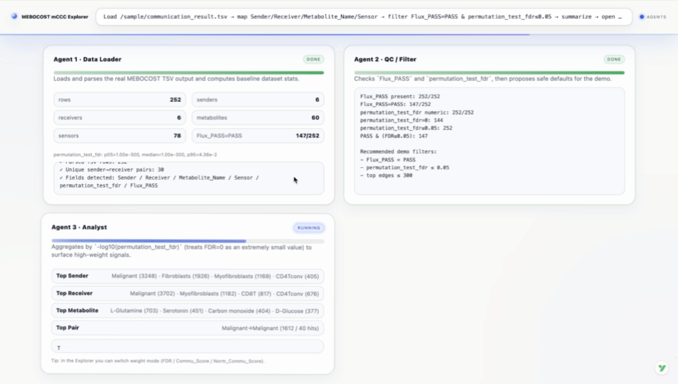

# mCCC Explorer
> **Review-Grade Interactive Analysis Platform for Metabolite-Mediated Cell–Cell Communication**
> Transforming MEBOCOST outputs into reproducible, explainable, and publication-ready visual narratives.

[](https://react.dev/)
[](https://vitejs.dev/)
[](https://tailwindcss.com/)
[](https://js.cytoscape.org/)
[](https://opensource.org/licenses/MIT)

> **Note:** This is a proof-of-concept developed in a rapid prototyping sprint. Intended for research demonstration and educational purposes. Not production-ready.

<p align="center">
  
</p>

## Overview

**mCCC Explorer** is a sophisticated interactive visualization platform designed for exploring **metabolite-mediated cell–cell communication (mCCC)** analysis results. Built to support top-tier journal review workflows, it transforms raw MEBOCOST-style outputs into evidence-backed, reproducible visual narratives.

> **From "I computed this" to "Reproducible, Explainable, Review-Ready"**

### Core Innovation

Traditional single-cell communication analysis tools often lack transparency and reproducibility. mCCC Explorer addresses this by providing:

- **Evidence-First Design** — Every visual element traces back to source data
- **Reproducible State** — Complete analysis state encoded in shareable URLs
- **Statistical Rigor** — Built-in robustness testing and null controls
- **LLM-Enhanced Insights** — AI-powered interpretation with structured evidence chains

**Research Alignment:**
- MEBOCOST: Metabolite-based cell-cell communication inference
- Nature Computational Science: Data-driven biological network analysis
- Explainable AI: Traceable, auditable analysis pipelines

---

## Key Features

### 1. Multi-View Interactive Visualization Engine

| View | Description |
|------|-------------|
| **Network Graph** | Force-directed sender–receiver relationship visualization with Cytoscape.js |
| **Adjacency Matrix** | Heatmap representation for dense communication pattern identification |
| **Dot Plot Analytics** | Statistical distribution analysis by metabolite/sensor/cell type |
| **Data Table** | Sortable, filterable tabular interface with real-time search |
| **Compare Mode** | Side-by-side differential analysis across experimental conditions |

### 2. Evidence-First Interaction Design

- **Cross-View Binding** — Click any cell type or sender→receiver pair to highlight across all views
- **Details Drawer** — Surfaces top partners, metabolites, and sensors with one-click subnet focus
- **Row-Level Traceability** — Every insight links to specific data rows
- **Visual Consistency** — Unified color encoding and filter state across views

### 3. Robustness & Reproducibility Framework

- **Sensitivity Analysis** — Parameter variation testing across FDR thresholds and top-N edges
- **Null Control Testing** — Randomization-based significance testing with p-value computation
- **Reproducible URLs** — Full state serialization in query strings for shareable analysis
- **Export Capabilities** — HTML reports, Markdown insights, JSON data, TSV filtered tables

### 4. LLM-Powered Intelligence (Optional)

- **OpenAI-Compatible API** — Configurable via environment variables
- **Data-Grounded Insights** — Prompts injected with filtered data to prevent hallucination
- **Structured Output Parsing** — Extracts claims and evidence references from LLM responses
- **Graceful Fallback** — Demo mock output ensures presentations never fail

### 5. Multi-Agent Analysis Architecture (J2-Style)

The platform is designed around a **multi-agent orchestration paradigm** — decomposing complex mCCC analysis into specialized, composable agents:

```
┌──────────────────────────────────────────────────────────────┐
│  🖥️  Terminal-Style Command Input (Typewriter Animation)     │
├──────────────────────────────────────────────────────────────┤
│                                                              │
│  ┌─────────────┐  ┌─────────────┐  ┌─────────────┐           │
│  │  Agent 1    │  │  Agent 2    │  │  Agent 3    │   ...     │
│  │  Data Load  │→ │  Network    │→ │  Statistics │→          │
│  │  & Parse    │  │  Analysis   │  │  Summary    │           │
│  └─────────────┘  └─────────────┘  └─────────────┘           │
│       ↓                ↓                ↓                    │
│  Progress Bar    Progress Bar    Progress Bar                │
│                                                              │
├──────────────────────────────────────────────────────────────┤
│  [Enter Explorer →]  Deep-link with pre-loaded dataset       │
└──────────────────────────────────────────────────────────────┘
```

**Architecture Vision:**

| Agent | Responsibility | Status |
|-------|----------------|--------|
| **Data Agent** | Parse CSV/TSV, validate schema, auto-map columns | ✅ Implemented |
| **Network Agent** | Build sender-receiver graph, compute topology metrics | ✅ Implemented |
| **Statistics Agent** | FDR filtering, robustness testing, null controls | ✅ Implemented |
| **Insight Agent** | LLM-powered interpretation with evidence chains | ✅ Implemented |
| **Orchestrator** | Coordinate agent execution, manage state, narrative UI | 🚧 Demo |

**Current Demo Features:**
- Typewriter command input with immersive terminal aesthetics
- Sequential agent cards with progress visualization
- Real dataset integration (`communication_result.tsv`)
- One-click deep-link into Explorer with pre-populated state

**Roadmap:** The modular agent architecture enables future extensions — custom analysis pipelines, plugin agents, and automated report generation.

This design transforms complex bioinformatics workflows into an **engaging, narrative-driven experience** — ideal for presentations, demos, and paper defense scenarios.

---

## Technical Architecture

```
┌─────────────────────────────────────────────────────────────────┐
│                        mCCC Explorer                            │
├─────────────────────────────────────────────────────────────────┤
│  ┌─────────────┐  ┌─────────────┐  ┌─────────────────────────┐  │
│  │   Landing   │  │  Explorer   │  │    Shared Components    │  │
│  │    Demo     │◄─┤    Core     │◄─┤  • NetworkView          │  │
│  │  (J2-style) │  │             │  │  • MatrixView           │  │
│  └──────┬──────┘  └──────┬──────┘  │  • DotPlotView          │  │
│         │                │         │  • TableView            │  │
│         ▼                ▼         │  • CompareView          │  │
│  ┌─────────────────────────────┐   │  • InsightsPanel        │  │
│  │    Query State Manager      │   │  • LlmPanel             │  │
│  │   (URL ↔ Filter Sync)       │   └─────────────────────────┘  │
│  └─────────────────────────────┘                                │
├─────────────────────────────────────────────────────────────────┤
│                        Data Layer                               │
│  ┌─────────────┐  ┌─────────────┐  ┌─────────────────────────┐  │
│  │   Parser    │  │  Transform  │  │      LLM Client         │  │
│  │  • CSV/TSV  │  │  • Events   │  │  • OpenAI Compatible    │  │
│  │  • Mapping  │  │  • Filters  │  │  • Streaming Support    │  │
│  │  • Preset   │  │  • Stats    │  │  • Mock Fallback        │  │
│  └─────────────┘  └─────────────┘  └─────────────────────────┘  │
└─────────────────────────────────────────────────────────────────┘
```

### Technology Stack

| Layer | Technologies |
|-------|--------------|
| **Frontend Framework** | React 19.2, Vite 7, ES2024+ |
| **Network Visualization** | Cytoscape.js 3, react-cytoscapejs |
| **Charts & Plots** | Recharts 3, Custom SVG Components |
| **Styling** | TailwindCSS 4, CSS Custom Properties |
| **Data Processing** | PapaParse, Custom Transform Pipeline |
| **AI Integration** | OpenAI-compatible API, Mock Fallback |
| **Icons** | Lucide React |

---

## Quick Start

### Prerequisites

- Node.js 18+ (LTS recommended)
- pnpm 8+ (recommended) or npm

### Installation

```bash
# Clone the repository
git clone https://github.com/your-org/mccc-explorer.git
cd mccc-explorer

# Install dependencies
pnpm install

# Start development server
pnpm dev
```

Default port: `5174` (configurable in `vite.config.js`)

### Demo Landing Page

For presentation-ready demonstrations with pre-loaded data:

```
http://localhost:5174/demos/mccc_cascade_landing.html
```

The landing page:
- Loads real sample data from `public/sample/communication_result.tsv`
- Presents 4 sequential analysis agents with typewriter animation
- Deep-links into Explorer with pre-populated import panel
  
<p align="center">
  
</p>

---


## Data Input

### Supported Formats
- CSV (comma-separated)
- TSV (tab-separated)

### Column Mapping

| Field | Required | Description |
|-------|----------|-------------|
| `Sender` | Yes | Sending cell type |
| `Receiver` | Yes | Receiving cell type |
| `Metabolite` | No | Metabolite name |
| `Sensor` | No | Sensor/receptor name |
| `FDR` | Recommended | False discovery rate |
| `Score` | Recommended | Communication score |

### Weight Calculation Priority
1. `-log10(FDR)` when valid FDR available
2. `Score` as fallback
3. `1` as default

### MEBOCOST Output Preset

Typical MEBOCOST columns auto-mapped:
- `Sender`, `Receiver`
- `Metabolite_Name` / `Metabolite`
- `Sensor`
- `permutation_test_fdr`
- `Commu_Score` / `Norm_Commu_Score`

Recommended filters for review:
- `Flux_PASS = PASS`
- `permutation_test_fdr ≤ 0.05`

---

## URL API (Shareable & Reproducible)

All state serializes to query string for reproducible analysis:

| Parameter | Description |
|-----------|-------------|
| `sample=<file>` | Auto-load from `public/sample/<file>` |
| `view=network\|matrix\|dotplot\|table\|insights\|compare\|llm` | Active view |
| `w=neglog10_fdr\|commu_score\|norm_commu_score` | Weight mode |
| `fdr=<number>` | Maximum FDR threshold |
| `top=<number>` | Top N edges |
| `self=0\|1` | Include self-loops |
| `flux=all\|pass\|unpass` | Flux filter |
| `m=<string>` | Metabolite query |
| `s=<string>` | Sensor query |
| `focus=<string>` | Focus cell type |
| `focusMode=any\|incoming\|outgoing` | Focus direction |

**Example:**
```
/?sample=communication_result.tsv&view=network&flux=pass&fdr=0.05&top=300&self=0
```

---

## Keyboard Shortcuts

| Shortcut | Action |
|----------|--------|
| `⌘/Ctrl + ⇧ + C` | Copy shareable URL |
| `⌘/Ctrl + ⇧ + E` | Export HTML report |
| `⌘/Ctrl + K` | Toggle Actions menu |

---

## LLM Configuration (Optional)

Configure via environment variable:

```bash
export VITE_LLM_API_URL="https://api.openai.com/v1"
pnpm dev
```

For CORS issues, use the dev proxy:

```bash
export VITE_LLM_API_URL="/llm/v1"
export MCCC_LLM_UPSTREAM="https://<your-endpoint>"
pnpm dev
```

> **Note:** If `VITE_LLM_API_URL` is empty or request fails, the system automatically falls back to demo mock output with structured claims and evidence.

---

## Project Structure

```
src/
├── components/              # React UI Components
│   ├── NetworkView.jsx      # Cytoscape.js network graph
│   ├── MatrixView.jsx       # Adjacency heatmap
│   ├── DotPlotView.jsx      # Statistical dot plots
│   ├── TableView.jsx        # Filterable data table
│   ├── CompareView.jsx      # Differential comparison
│   ├── InsightsPanel.jsx    # AI insights & robustness
│   ├── LlmPanel.jsx         # LLM configuration
│   ├── FileImport.jsx       # Data import & mapping
│   ├── FiltersPanel.jsx     # Filter controls
│   └── DetailsDrawer.jsx    # Selection details
├── lib/                     # Core Utilities
│   ├── transform.js         # Data transformation pipeline
│   ├── parse.js             # CSV/TSV parsing & mapping
│   ├── robustness.js        # Statistical testing
│   ├── intelligence.js      # Insight generation
│   ├── compare.js           # Differential analysis
│   ├── report.js            # Export utilities
│   ├── queryState.js        # URL state management
│   └── llmClient.js         # LLM API client
├── styles.css               # Global styles & themes
└── App.jsx                  # Main application shell
```

---

## Research Applications

### Systems Biology
- Map metabolite-mediated intercellular signaling networks
- Identify hub cell types in communication ecosystems
- Characterize tissue-specific metabolic crosstalk

### Drug Discovery
- Identify targetable metabolic communication axes
- Screen perturbation effects on communication networks
- Validate drug mechanism hypotheses

### Academic Publishing
- Generate publication-ready figures
- Provide reproducible analysis workflows
- Support peer review with transparent methodology

---

## Performance

- **Scalability** — Handles 10,000+ communication events smoothly
- **Responsive** — Optimized for desktop and tablet viewports
- **Lazy Loading** — View components loaded on demand
- **Memoization** — Strategic `useMemo` for expensive computations

---

## Build

```bash
pnpm build
pnpm preview
```

---

## Contributing

We welcome contributions from the computational biology and systems biology communities.

1. Fork the repository
2. Create a feature branch (`git checkout -b feature/amazing-feature`)
3. Commit your changes (`git commit -m 'Add amazing feature'`)
4. Push to the branch (`git push origin feature/amazing-feature`)
5. Open a Pull Request

---

## License

MIT License - See [LICENSE](LICENSE) for details.

---

## Acknowledgments

This project draws inspiration from leading computational biology research:

- **MEBOCOST** — Metabolite-mediated cell-cell communication inference
- **Harvard Medical School** — Systems biology methodology
- **MIT Computational Biology** — Interactive analysis paradigms

---

<p align="center">
  <strong>mCCC Explorer</strong><br>
  <em>Where Metabolomics Meets Cell Communication</em>
</p>
